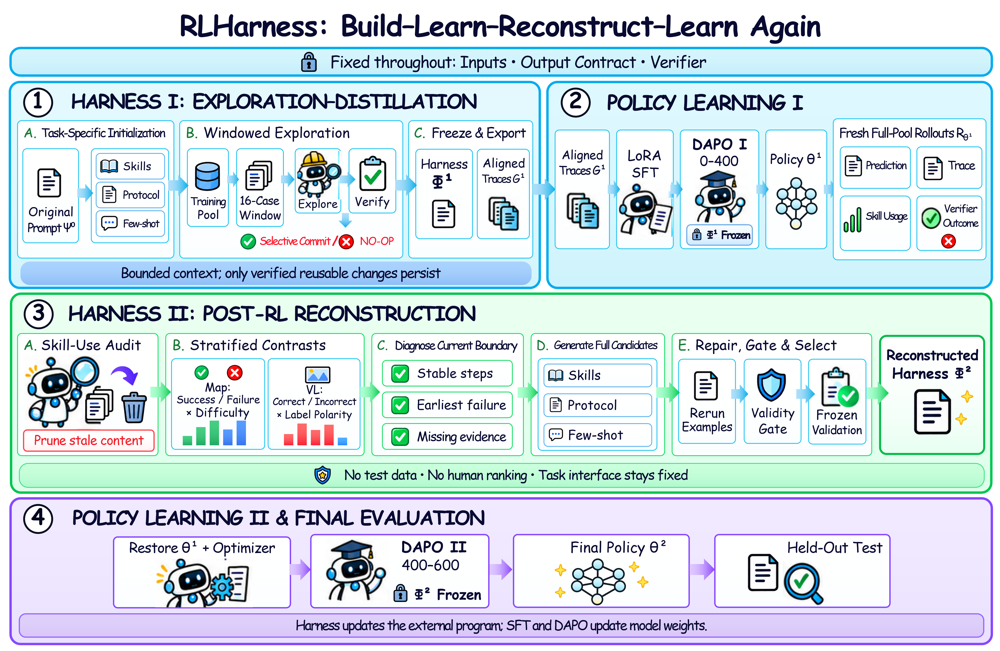

# RLHarness

RLHarness is a skill-augmented training framework for the MetroMap and TravelMap multimodal route-planning tasks. It connects skill initialization, teacher trajectory generation, supervised fine-tuning, two-stage GRPO, rollout-driven skill evolution, and fixed-set evaluation into one reproducible workflow.

Both domains share the training and evaluation implementation while retaining domain-specific prompts, settings, and fixed data splits. The repository does not include the raw MapTab data, base model, or final model weights.



## Abstract

Multimodal reasoning requires models to preserve visual evidence through long decision chains while selecting appropriate procedures across diverse scenarios and rules. When learning is guided only by terminal verifiers, reinforcement learning (RL) reveals whether a final answer is correct but not how it should be produced. The policy must therefore discover reusable reasoning procedures while learning to execute them, creating a program cold-start problem. Skills can externalize successful procedures, reduce repeated exploration, and provide inspectable guidance. However, a fixed Skill Bank assumes that this guidance remains compatible with an evolving policy, while updating Skills alone can leave their triggers, execution protocols, and demonstrations stale or mutually inconsistent. We introduce RLHarness, which organizes Skills, selection and execution protocols, few-shot demonstrations, and task contracts into a unified, versioned Harness and alternates Harness evolution with policy learning. An Exploration--Distillation Harness builds the initial Harness and version-aligned verified traces for SFT and DAPO I. After the first RL block, a Post-RL Reconstruction Harness rebuilds Skills, protocols, and demonstrations from fresh success--failure rollouts, and DAPO II adapts the policy to the reconstructed program. RLHarness improves Accuracy from 16.25%/27.50% to 62.00%/50.00% on MetroMap/TravelMap and raises F1 score from 37.13%/45.50% to 65.81%/65.51% on Fee-VL/Cancel-VL. All four tasks achieve their best results only after reconstruction and DAPO II, showing that an evolving Harness complements RL by continually updating the external program that the policy learns to execute.

## Configuration

| Item | Fixed setting |
| --- | --- |
| Tasks | MetroMap and TravelMap |
| Base model | Qwen3.5-9B |
| Initial skill optimization | Gemini-3.5 student, GPT-5.6 teacher, up to 12 steps |
| SFT teacher | GPT-5.6-sol |
| SFT | 2 epochs, LoRA rank 16, learning rate `5e-6` |
| Reinforcement learning | GRPO + Hybrid-DGPO, 8 rollouts per question, 4 GPUs |
| Training stages | Original skills through step 400, evolved skills from step 400 to 600 |
| Final evaluation | Fixed Test400, exact and partial route accuracy |

## Experimental Protocol

Each domain uses fixed, mutually disjoint sample IDs. Train1600 is used for SFT trajectory generation and RL training, Val100 is used for SkillOpt gates, candidate evaluation, and automatic selection, and Test400 is used only for final evaluation.

Every public entry point reads `data/reference/<domain>/splits/`. Generated output locations may be changed, but sample IDs may not be replaced or silently resampled. The program stops if IDs are missing, have incorrect counts, overlap, or conflict with an existing run directory.

### Fixed Sample ID Files

The committed sample IDs are stored directly in the repository:

```text
data/reference/metromap/splits/
  train_sample_ids.json
  validation_sample_ids.json
  test_sample_ids.json
  manifest.json

data/reference/travelmap/splits/
  train_sample_ids.json
  validation_sample_ids.json
  test_sample_ids.json
  manifest.json
```

The three `*_sample_ids.json` files contain the locked Train1600, Val100, and Test400 IDs. Each `manifest.json` records the corresponding split policy, seed, counts, and isolation checks. These files define the experimental splits; generated copies under `data/generated/` are derived artifacts and must not replace them.

| Domain | Train | Validation | Test | Primary metric |
| --- | ---: | ---: | ---: | --- |
| MetroMap | 1600 | 100 | 400 | Exact route accuracy |
| TravelMap | 1600 | 100 | 400 | Exact route accuracy |

MetroMap isolates the three sets by sample ID. TravelMap additionally isolates them by map. Split manifests and fixed IDs are stored under `data/reference/<domain>/splits/`. Test400 is never used for training, prompt updates, or candidate selection.

```text
Initial skill prompt
  -> teacher trajectory generation and programmatic audit
  -> Qwen3.5-9B SFT
  -> first GRPO round, steps 0-400
  -> rollout-driven skill evolution and synchronized prompt rewriting
  -> candidate selection from Val100 accuracy and skill usage
  -> second GRPO round, steps 400-600
  -> fixed Test400 evaluation
```

## Repository Layout

```text
configs/                  SkillOpt, SFT, and GRPO configurations
data/                     data sources and fixed split IDs
docs/                     training, environment, and reward documentation
prompts/                  initialization, SFT, evolution, and student prompts
scripts/                  data preparation and stage 00-06 entry points
src/rlharness/            data, training, evolution, reward, and evaluation code
src/skillopt/             installed SkillOpt engine and prompts
tests/                    API-free and GPU-free regression tests
third_party/              pinned LLaMA-Factory, VERL, and SkillOpt provenance
```

Generated `data/generated/`, `artifacts/`, and `results/` directories are ignored by Git.

## Installation

Python 3.10 or newer is required.

```bash
git clone <repository-url>
cd RLHarness

python -m venv .venv
source .venv/bin/activate
python -m pip install --upgrade pip
python -m pip install -e .
```

SFT and GRPO use separate environments for `third_party/LlamaFactory` and `third_party/verl-modern`. Do not force both stacks into the lightweight orchestration environment. The verified Python, PyTorch, CUDA, Transformers, vLLM, Ray, LLaMA-Factory, and VERL versions are listed in [`docs/environment.md`](docs/environment.md).

API stages read credentials from environment variables:

```bash
export OPENLUX_API_KEY=your_key_here
export OPENLUX_BASE_URL=https://api.openlux.ai/v1
```

Never write real credentials into a configuration, prompt, script, or Git commit.

## Data Preparation

This repository does not redistribute raw MapTab images, vertex tables, or question files. After obtaining a valid MapTab snapshot that includes the training data, run:

```bash
bash scripts/prepare_data.sh --source /path/to/MapTab
```

Data is written to the sibling directory `../maptab_data/` by default. To use another location, set:

```bash
export MAPTAB_ROOT=/path/to/maptab_data
```

To validate an existing data directory without copying data:

```bash
bash scripts/prepare_data.sh --check-only
```

See [`data/README.md`](data/README.md) for source information, the expected layout, and public test-set download instructions.

## Running RLHarness

Public entry points are under `scripts/` and accept `--domain metromap|travelmap`.

| Stage | Command | Main output |
| --- | --- | --- |
| Initialize skills | `scripts/00_initialize_skills.sh` | best initial skills and complete prompt |
| Generate SFT data | `scripts/01_generate_sft_data.sh` | programmatically audited ShareGPT data |
| SFT | `scripts/02_train_sft.sh` | SFT LoRA and merged model |
| First GRPO round | `scripts/03_train_rl_round1.sh` | step-400 checkpoint and rollouts |
| Evolve and select skills | `scripts/04_evolve_skills.sh` | three generated and validated candidates, selected by GPT-5.6-sol |
| Second GRPO round | `scripts/05_train_rl_round2.sh` | step-600 checkpoint |
| Final evaluation | `scripts/06_evaluate_test.sh` | Test400 predictions and summary |
| Released-model evaluation | `scripts/07_evaluate_pretrained.sh` | downloaded full model and Test400 summary |

The repository includes the original and selected final prompts used by the experiment:

```text
prompts/student/<domain>/original.txt   SFT and first-round GRPO
prompts/student/<domain>/final.txt      second-round GRPO and final evaluation
```

### Reproduce the Selected Result

The committed `final.txt` is the selected prompt. Reproducing that path does not require rerunning skill evolution:

```bash
export QWEN35_MODEL=/path/to/Qwen3.5-9B
export OPENLUX_API_KEY=your_key_here

bash scripts/01_generate_sft_data.sh --domain metromap
bash scripts/02_train_sft.sh --domain metromap
bash scripts/03_train_rl_round1.sh --domain metromap
bash scripts/05_train_rl_round2.sh --domain metromap
bash scripts/06_evaluate_test.sh --domain metromap
```

### Rerun Skill Evolution

Stage 04 generates three candidates and evaluates them with Qwen3.5-plus on the fixed Val100. GPT-5.6-sol then reads the candidate report, including accuracy and per-skill usage, and returns a candidate name and reason. The same command persists the selection:

```bash
bash scripts/04_evolve_skills.sh --domain metromap

bash scripts/05_train_rl_round2.sh --domain metromap
bash scripts/06_evaluate_test.sh --domain metromap
```

The selection is stored in `artifacts/skill_evolution/selected/`. If the selector API is interrupted, rerun `04_evolve_skills.sh` with the same inputs to reuse completed candidates and Val100 results. The program binds predictions to the exact evaluated prompt and refuses to reuse old validation output for changed candidates. Both GRPO rounds also store their exact training prompt and reject an in-place resume if its contents change. Round two prioritizes the selected prompt, and final evaluation reads the same snapshot. If no selection directory exists, round two falls back to `prompts/student/<domain>/final.txt`.

See [`docs/training.md`](docs/training.md) for all environment variables, inputs, outputs, and resume behavior.

## Reinitialize Skills

To regenerate the initial skill prompt from the task frame, prepare Train480 from the fixed Train1600 and run stage 00:

```bash
DOMAIN=metromap

PYTHONPATH=src python -m rlharness.data_process.skillopt_split \
  --domain "$DOMAIN" \
  --split-dir "data/reference/$DOMAIN/splits" \
  --output-dir "data/generated/$DOMAIN/skillopt_train480"

bash scripts/00_initialize_skills.sh \
  --domain "$DOMAIN" \
  --split-dir "data/generated/$DOMAIN/skillopt_train480" \
  --output-dir "artifacts/$DOMAIN/skillopt"
```

Initialization generates seed skills, How to Use instructions, and few-shot examples. It then runs up to 12 SkillOpt steps and selects the best complete prompt on the fixed Val100. The main outputs are:

```text
artifacts/<domain>/skillopt/best/full_prompt.txt
artifacts/<domain>/skillopt/best/skills.json
```

Pass these files to SFT data generation through `STUDENT_PROMPT` and `ORIGINAL_SKILLS_JSON`. `02_train_sft.sh` inherits the same `GENERATED_DATA_DIR` and reads its `sft/` child:

```bash
export ORIGINAL_SKILLS_JSON="$PWD/artifacts/$DOMAIN/skillopt/best/skills.json"
export STUDENT_PROMPT="$PWD/artifacts/$DOMAIN/skillopt/best/full_prompt.txt"
export PROMPT_TEMPLATE="$STUDENT_PROMPT"
export GENERATED_DATA_DIR="$PWD/data/generated/$DOMAIN/skillopt_sft"
export SFT_DATA_DIR="$GENERATED_DATA_DIR/sft"

bash scripts/01_generate_sft_data.sh --domain "$DOMAIN"
bash scripts/02_train_sft.sh --domain "$DOMAIN"
```

## Final Evaluation

After round two, the default command evaluates the newly merged SFT model with the step-600 adapter:

```bash
VLLM_PYTHON=/path/to/vllm-env/bin/python \
GPU_IDS="0 1 2 3" \
bash scripts/06_evaluate_test.sh --domain metromap
```

To evaluate a separately released fully merged model, explicitly override the model path. The default adapter is not attached when `ADAPTER_PATH` is unset in this mode:

```bash
MODEL_PATH=/path/to/final/model \
VLLM_PYTHON=/path/to/vllm-env/bin/python \
GPU_IDS="0 1 2 3" \
bash scripts/06_evaluate_test.sh --domain metromap
```

To specify both a base model and an adapter:

```bash
MODEL_PATH=artifacts/sft_merged \
ADAPTER_PATH=artifacts/grpo_round2/checkpoints/global_step_600/adapter \
bash scripts/06_evaluate_test.sh --domain metromap
```

Default summary files:

```text
results/test400/predictions.summary.json
results/travelmap/test400/predictions.summary.json
```

### Evaluate the Released Full Models

The public model repository, [`szq-nju/RLHarness-MapTab-Models`](https://huggingface.co/szq-nju/RLHarness-MapTab-Models), stores two independent, fully merged checkpoints under `metromap/` and `travelmap/`. Each checkpoint already contains the Qwen3.5-9B base, SFT update, and selected RL update; no additional LoRA adapter is required.

The following commands download only the selected domain subfolder, apply the committed final Prompt, and evaluate the locked Test400 split with vLLM:

```bash
VLLM_PYTHON=/path/to/vllm-env/bin/python \
GPU_IDS="0 1 2 3" \
bash scripts/07_evaluate_pretrained.sh --domain metromap

VLLM_PYTHON=/path/to/vllm-env/bin/python \
GPU_IDS="0 1 2 3" \
bash scripts/07_evaluate_pretrained.sh --domain travelmap
```

Downloads are stored under `models/release/` and reused on subsequent runs. Set `RLHARNESS_MODEL_ROOT` to change that location. `RLHARNESS_MODEL_REPO` and `RLHARNESS_MODEL_REVISION` can point to a mirror or an immutable Hub revision. The lower-level training and evaluation scripts continue to support `MODEL_PATH` plus an optional `ADAPTER_PATH`, so locally trained LoRA checkpoints remain usable even though the public reproduction path uses complete merged weights.

## Local Validation

These checks do not call a model API or start GPU training:

```bash
bash scripts/verify_release.sh
python -m unittest discover -s tests -v
python -m compileall -q src
```

The release check validates fixed splits, configuration inheritance, required prompt sections, Python syntax, credential leakage, and accidental inclusion of raw data or model weights.

## Experimental Notes

- The SFT teacher does not receive the GT route. GT is used only for programmatic acceptance after generation.
- Skill evolution samples 128 successful and failed rollout traces, generates three complete candidates, and synchronizes each candidate's How to Use and few-shot sections.
- SFT and RL freeze the vision tower and multimodal projector by default and update only language-side LoRA parameters.
- Hosted API models may change over time. Formal runs should retain the model route, timestamp, prompt files, raw responses, and settings.
- See [`docs/reward.md`](docs/reward.md) for the reward definition, [`docs/training.md`](docs/training.md) for training parameters, [`docs/environment.md`](docs/environment.md) for the verified environment, and [`NOTICE.md`](NOTICE.md) for third-party and data notices.

## Data Sources

MapTab data comes from the [official MapTab repository](https://github.com/Ziqiao-Shang/MapTab) and the [MapTab Hugging Face dataset](https://huggingface.co/datasets/szq-nju/MapTab). Follow the original project's license and usage terms.
